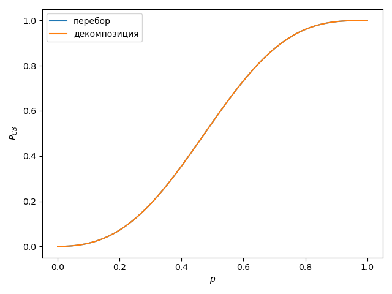

# Декомпозиция случайного графа
Здесь представлен переборный алгоритм для нахождения вероятности пути в случайном графе. Проведено сравнение результатов этого алгоритма и "ручного" вычисления с использованием декомпозиции.

