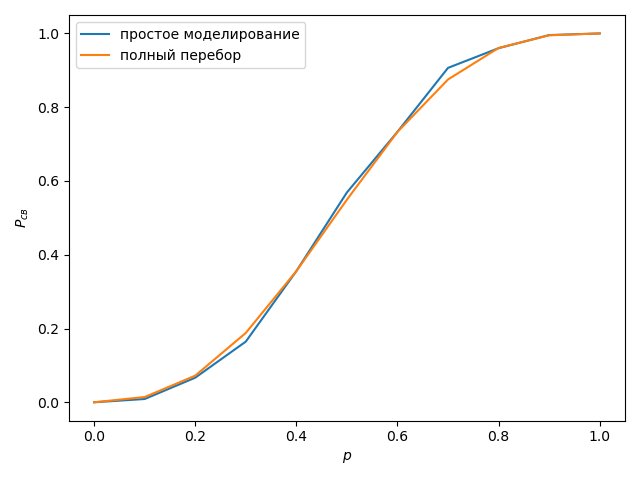
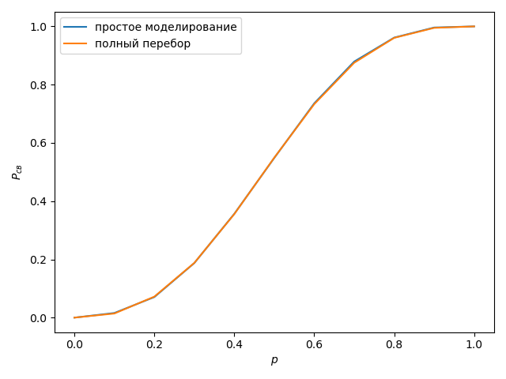
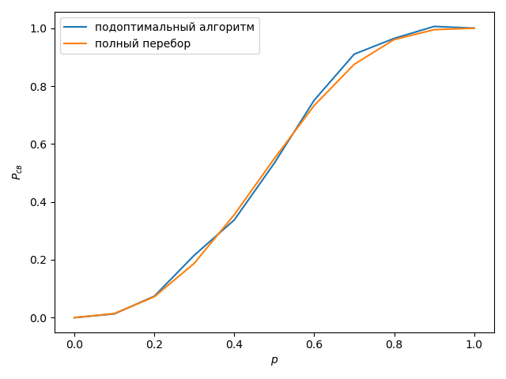
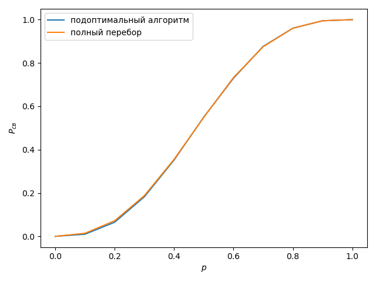
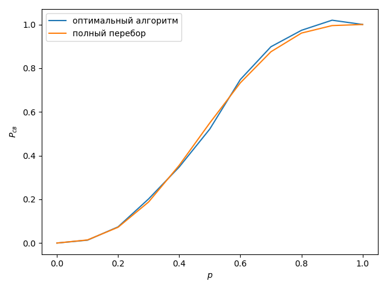

# Исследование алгоритмов имитационного моделирования
Данная программа используется для исследования алгоритмов имитационного 
моделирования.

Т.к. задача полного перебора слишком сложна в вычислительном плане,
то для того, чтобы добиться схожих результатов применяются
 алгоритмы на основе имитационного моделирования. 
 Суть данных алгоритмов заключается в рассмотрении не всего
  множества подграфов, а лишь его части. 
  Данные алгоритмы оказываютсяболее эффективными по
   времени, но проигрывают в точности, что следует из 
   написанного выше.

## Простое имитационное моделирование
>Графики зависимостей
      для простого моделирования и полного перебора. e = 0.1
      

     
>Графики зависимостей для простого моделирования и
> полного перебора. e = 0.01

## Подоптимальный алгоритм расслоенной выборки

>  Графики зависимостей для подоптимального
> алгоритма и полного перебора. e= 0.1

     
> Графики зависимостей для подоптимального алгоритма и
> полного перебора. e = 0.01

## Оптимальный алгоритм расслоенной выборки
> Графики зависимостей для оптимального алгоритма
> и полного перебора. e = 0.1

     
>Графики зависимостей для оптимального алгоритма и 
>полного перебора. e = 0.01

