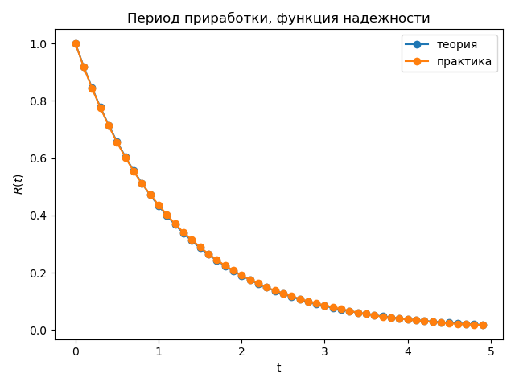
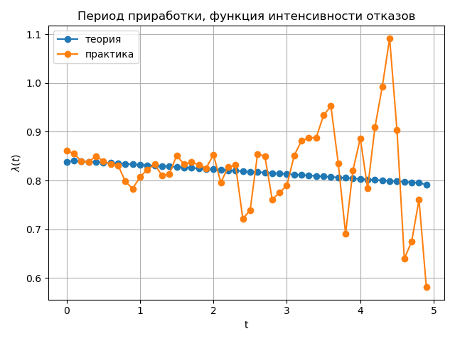
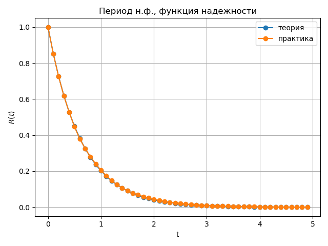
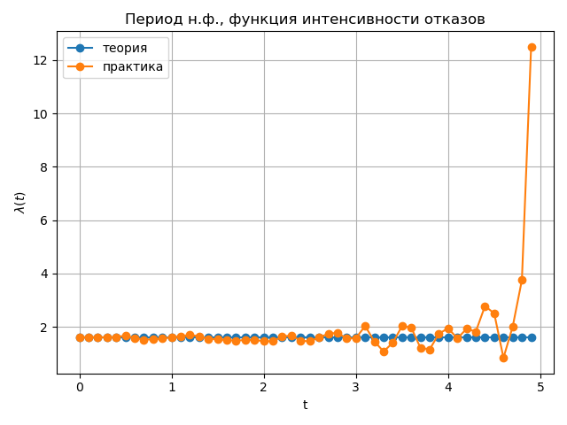
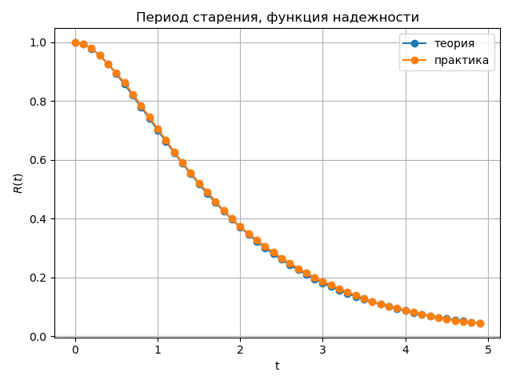
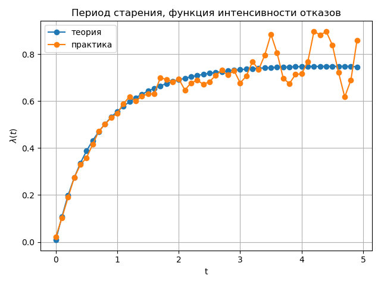

# Невосстанавливаемая система
Данная программа реализует имитационное моделирование процесса функционирования невосстанавливаемой системы для всех ее периодов жизни.
Далее будут представлены результаты моделирования для всех периодов жизни системы: зависимости функций интенсивности отказов и надежности от времени работы.

## Период приработки

>

## Период нормального функционирования

>

## Период старения

>

